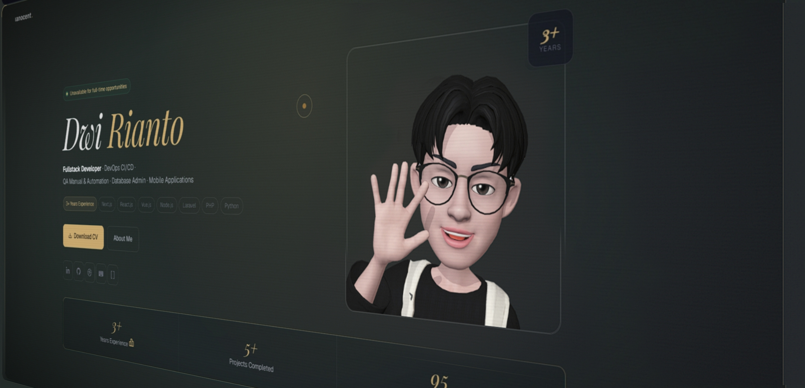

  

  <h1>Dwi Rianto — @ianocent</h1>
  <h3>Fullstack Developer · DevOps CI/CD · QA Automation · Mobile Apps</h3>
  
<i>Multimedia Nusantara University Graduate · 3+ Years Experience</i>

  

    <a href="https://ianocent.github.io"><strong>🌐 Portfolio</strong></a> ·
    <a href="https://ianocent.github.io/blog"><strong>📝 Blog</strong></a> ·
    <a href="https://linkedin.com/in/dwirianto"><strong>💼 LinkedIn</strong></a>
  

---

## 👨‍💻 About Me

I'm **Dwi Rianto**, a Fullstack Developer from Indonesia with ~3 years of experience building production-grade web and mobile applications. I specialize in:

- **Frontend:** Next.js, React.js, Vue.js, Tailwind CSS
- **Backend:** Laravel, Node.js (Express), PHP, Python
- **Mobile:** Android (Kotlin, Jetpack Compose)
- **DevOps:** CI/CD pipelines, GitLab/GitHub, Linux server, Nginx
- **QA:** Manual & Automation testing (Selenium, Katalon)
- **Database:** MySQL, PostgreSQL, Prisma ORM, Eloquent
- **Other:** UI/UX Design (Figma), IT Support, Hardware & Networking

I'm passionate about building systems that are clean, scalable, and well-documented. Currently available for full-time opportunities.

---

## 🚀 Featured Projects

### 🏨 Hotel Management System (HMS Anyaman)
Full-featured HMS covering room booking, front desk, housekeeping, rate management, event management, and role-based access. Built with **Next.js + Laravel + MySQL**, currently migrating backend to **Node.js + Express + Prisma + PostgreSQL**.

- 186 database tables, 80+ API endpoints
- Complex permission system with CRUD flags per role
- OTA integration (STAAH)
- Real-time dashboards with revenue analytics
- [Read case study →](https://ianocent.github.io/blog/hms-case-study)

### 🎵 IanPlayer — Android Music Player
Native Android music player built with **Kotlin + Jetpack Compose (Material 3)**. Features local library scanning, YouTube Music streaming (InnerTube API), synced lyrics, audio visualizer recording, card generators, and monthly recaps (Spotify Wrapped-style).

- 20,000+ lines of Kotlin
- 30+ UI screens built with Compose
- Media3 ExoPlayer + MediaSessionService
- Auto-updater from GitHub Releases
- [Repository](https://github.com/ianocent/IanPlayer) · [Read case study →](https://ianocent.github.io/blog/ianplayer-case-study)

### 🎨 Design Projects
- **Vape Thing App** — Mobile app UI/UX prototype in Figma
- **Calligraphy Expert System** — UI/UX design for an expert system
- **Kompas Redesign** — News portal UI redesign
- **WhatsApp Redesign** — Concept UI redesign

---

## 📫 Let's Connect

  <a href="https://linkedin.com/in/dwirianto">LinkedIn</a> ·
  <a href="https://ianocent.github.io">Portfolio</a> ·
  <a href="https://github.com/ianocent">GitHub</a> ·
  <a href="https://dribbble.com/Ntoo">Dribbble</a>
    
  <b>Email:</b> riantodwi2002@gmail.com

